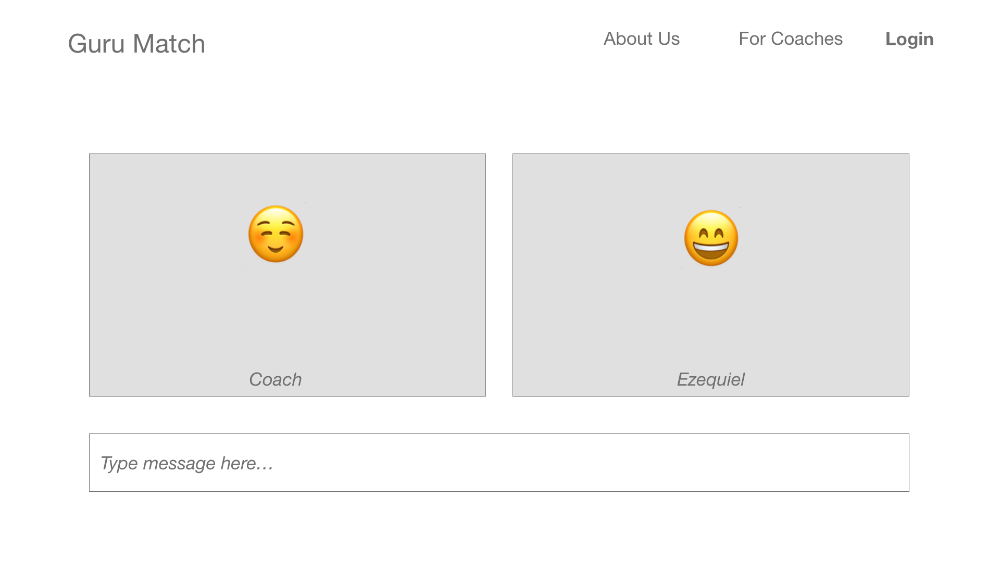
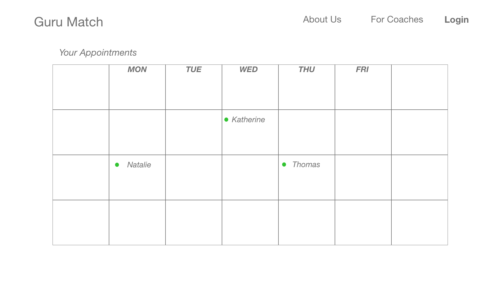

 # Project 3
 UT Austin Coding Bootcamp \
 Project Team: Ezequiel Calderon, Federico Paredes \
 Est. Project Launch - February 4, 2018
 
 # Project Proposal
  
 **Guru Match** \
Guru Match is the easiest way to find a personal coach. Tell us about your goals in a brief, private questionnaire, and our proprietary algorithm will match you with three potential coaches. Get to interview each coach using our video service and consider which coach you are most comfortable with. Then, you can decide which coach worked best, or get three more coaches!

Guru Match also offers scheduling services to coaches to keep all appointments in one place, along with contact and profile details of clients. 

Main features: questionnaire, matching algorithm, video 1:1 conferencing, calendar and scheduling
 
 # Rough Sketch / Prototype
  \
  \
  
 
 # Tech Used
To be confirmed \
React \
WebRTC \
Socket.io
 
 # Tasks and Next Steps
 - Get proposal approved
