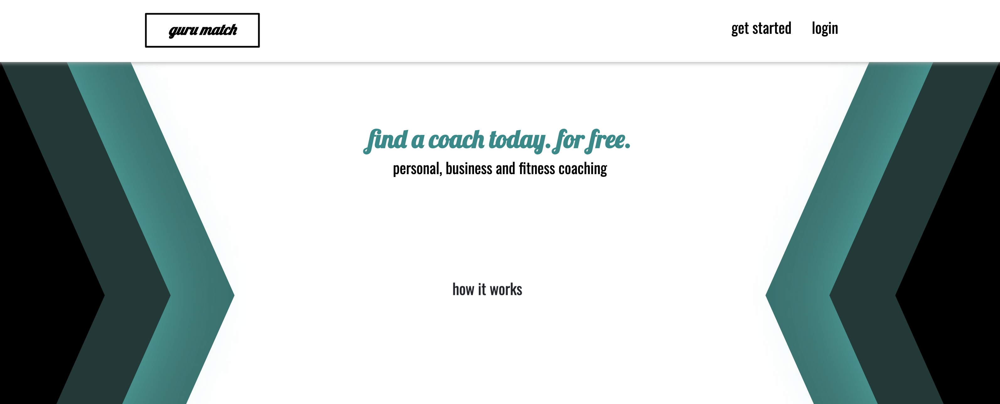

 # guru match :black_square_button:
 UT Austin Coding Bootcamp \
 Project Team: Ezequiel Calderon, Federico Paredes \
 Orig. Deployment - February 4, 2018
 
 
# Idea
Guru Match is the easiest way to find a personal coach. Users tell us about their goals in a brief, private questionnaire, and our proprietary algorithm match clients with three potential coaches. Users will get to interview each coach using our video service and then, consider which coach is best for them.

Guru Match also offers scheduling services to clients to keep all appointments in one place, along with contact details of coaches. 

# User Guide
</a>

Here's how it works:

- On the landing page, navigate down and learn how guru match works.
- Create an account, complete the survey, and then receive coach matches.
- Schedule an appointment with each coach, and when it's time, start the video chat. 
- Have fun!

# Built Utilizing: 
SVG background \
React.js 16.7.0 - <https://reactjs.org/> \
Bootstrap v4 - <https://stackpath.bootstrapcdn.com/bootstrap/4.1.3/css/bootstrap.min.css> \
Firebase Auth & Real-time Database - <https://firebase.google.com/> \
Animate.css - <https://daneden.github.io/animate.css/> \
React-scroll-to-component - <https://www.npmjs.com/package/react-scroll-to-component> \
Scaledrone Video Service - <https://www.scaledrone.com/> \
GoLang - <https://golang.org/> 

# Original Contributors:
Ezequiel Calderon - <https://github.com/playeasynow> \
Federico Paredes - <https://github.com/chainfire21>

# Get Involved!
If you have any recommendations, let us know! Email: ezequiel.calderon.jr@gmail.com. If you'd like to take it in your own direction, go right ahead. 
